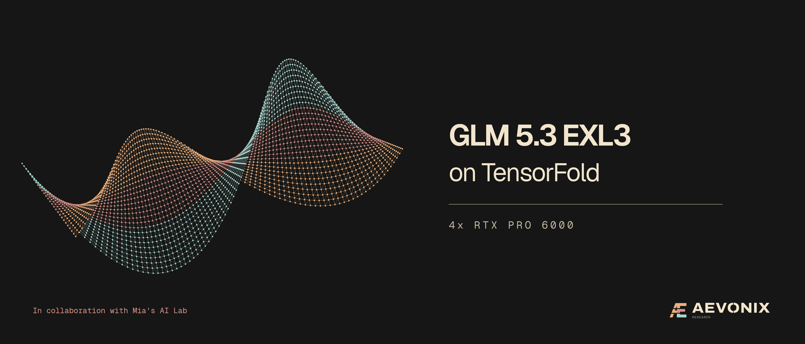
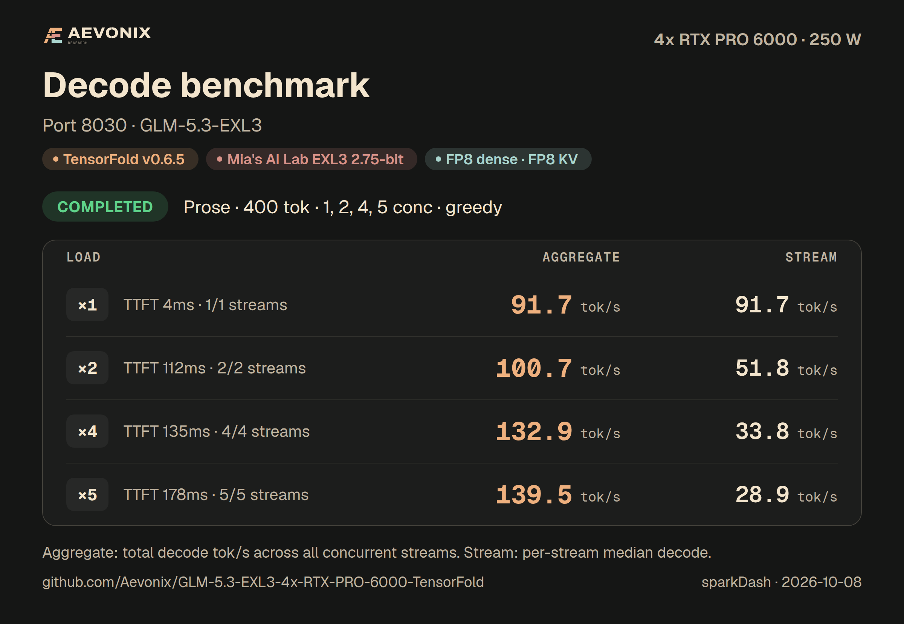
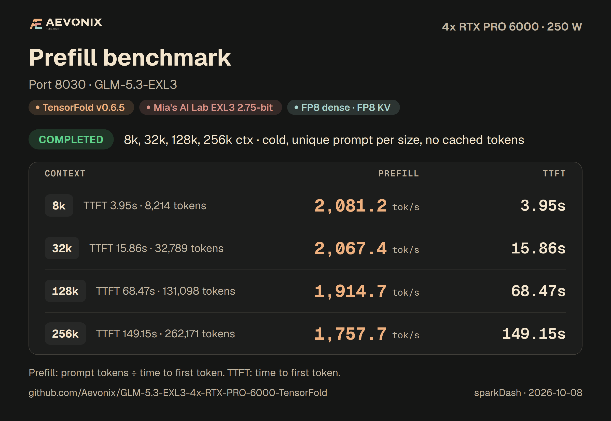
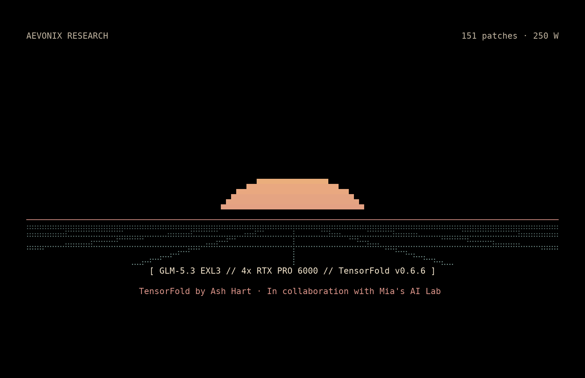

<!-- releasekit:header:start -->
<p align="center">
  <a href="https://aevonix.com">
    
  </a>
</p>

<h1 align="center">GLM-5.3 EXL3 on 4x RTX PRO 6000 with TensorFold</h1>

<p align="center">A one-command recipe for full GLM-5.3 on 4x RTX PRO 6000: five sessions and a 1M context on one Linux host.</p>

<p align="center"><sub>by <a href="https://aevonix.com">Aevonix Research</a> · in collaboration with <a href="https://x.com/MiaAI_lab">Mia's AI Lab</a></sub></p>

<p align="center">
  <a href="https://aevonix.com"></a>
  <a href="https://huggingface.co/Mia-AiLab"></a>
  <a href="https://github.com/ashhart/TensorFold"></a>
  
  <a href="LICENSE"></a>
</p>

<p align="center"></p>
<!-- releasekit:header:end -->

<!-- releasekit:summary:start -->
This one-command recipe serves **GLM-5.3** on one Linux host with **four 96 GB RTX PRO 6000 Blackwell GPUs**, through an
OpenAI-compatible API, with **5 concurrent sessions**, **1,048,576 tokens per request**, tool calling and structured
outputs. It serves text only. This recipe combines [TensorFold](https://github.com/ashhart/TensorFold) v0.6.6,
Mia's AI Lab's EXL3 checkpoint and full-model recipe patches, and Aevonix Research's single-host PCIe optimizations.
One command builds, downloads and starts it.

- **Checkpoint:** [`Mia-AiLab/GLM-5.3-EXL3-2.75bpw-TensorFold`](https://huggingface.co/Mia-AiLab/GLM-5.3-EXL3-2.75bpw-TensorFold),
  EXL3 routed experts averaging 2.75 bits per weight, with dense layers converted to FP8 at load time.
- **Drafter:** [`RedHatAI/GLM-5.3-speculator.dspark`](https://huggingface.co/RedHatAI/GLM-5.3-speculator.dspark) (DSpark),
  plus copy drafts. DFlash2 is an opt-in, non-commercial alternative with `PARALLEL=1`.
- **API model id:** `glm-5.3`.
- **Context:** 1,048,576 tokens per request; five sessions share one 1,245,184-token FP8 KV pool, with RAM and NVMe
  prompt tiers. Exact long-context retrieval is verified to 747,292 tokens.
- **Concurrency:** 5 sessions by default (`PARALLEL=5`).
- **One command:** `./start.sh`; restart with `./start.sh restart`, stop with `./stop.sh`.
<!-- releasekit:summary:end -->

## Performance

**TensorFold v0.6.6.** The published measurements below come from the v0.6.5 build. A/B validation on
4x RTX PRO 6000 Blackwell Server Edition GPUs used the same checkpoint and settings. Gate and gatelong
were identical, first-token probes matched 40/40, and default and required tool bursts stayed at 90/90 each.
The `--name-priority` smoke test passed. Single-stream decode and cold prefill stayed within about 1%.
No regression was observed. Four-stream decode has a process warm-state caveat, so no gain is claimed.
See [validation notes](docs/NOTES.md#tensorfold-v066).

<!-- releasekit:performance:start -->
Four RTX PRO 6000 Blackwell Max-Q GPUs, one PCIe host.

[sparkDash](https://github.com/MiaAI-Lab/sparkDash) v1.8.9 measured TensorFold on 2026-10-08.

Power: **250 W per GPU**.

sampling: greedy; temperature: 0; top_p: 1; thinking: off; reply tokens: 400.

Measured on the TensorFold v0.6.5 final v13 image with the production profile, served by a separate test instance on 2026-10-08 (250 W). Decode rows are the median-aggregate run of three repeats at each concurrency. Decode-table TTFT is warm: sparkDash repeats the same short prompt and TensorFold serves the first token from the saved end-of-prompt state. Prefill uses a fresh, unique prompt per size with no cached tokens.
<!-- releasekit:performance:end -->

**Decode** (aggregate across the concurrent requests, median per request, and median time to first token)

<!-- releasekit:decode:start -->
| Concurrent requests | Prose | Prose, per request | TTFT | Structured | Structured, per request | TTFT |
| ---: | ---: | ---: | ---: | ---: | ---: | ---: |
| 1 | 91.7 tok/s | 91.7 tok/s | 4 ms | 157.0 tok/s | 157.0 tok/s | 4 ms |
| 2 | 100.7 tok/s | 51.8 tok/s | 112 ms | 212.8 tok/s | 106.9 tok/s | 63 ms |
| 4 | 132.9 tok/s | 33.8 tok/s | 135 ms | 210.3 tok/s | 54.1 tok/s | 174 ms |
| 5 | 139.5 tok/s | 28.9 tok/s | 178 ms | 194.5 tok/s | 39.6 tok/s | 228 ms |
<!-- releasekit:decode:end -->

Within a fixed configuration, the [exactness checks](#checks) compare replies served together with the same
requests served alone, and drafted replies with serial replies. Decode-table TTFT is warm: sparkDash repeats the same
short prompt, and TensorFold serves its first token from the saved end-of-prompt state. Cold TTFT is in Prefill.

**Code** (the same decode measurements)

<!-- releasekit:code:start -->
| Concurrent requests | Code | Code, per request | TTFT |
| ---: | ---: | ---: | ---: |
| 1 | 130.3 tok/s | 130.3 tok/s | 30 ms |
| 2 | 166.5 tok/s | 87.8 tok/s | 54 ms |
| 4 | 149.7 tok/s | 38.7 tok/s | 116 ms |
| 5 | 150.6 tok/s | 30.9 tok/s | 134 ms |
<!-- releasekit:code:end -->

**Prefill** (cold prompts, with actual prompt token counts)

<!-- releasekit:prefill:start -->
cold, unique prompt per size, no cached tokens.

| Prompt | Prefill | Time to first token |
| --- | ---: | ---: |
| 8,214 tokens | 2,081 tok/s | 3.95 s |
| 32,789 tokens | 2,067 tok/s | 15.86 s |
| 131,098 tokens | 1,915 tok/s | 68.47 s |
| 262,171 tokens | 1,758 tok/s | 149.15 s |
<!-- releasekit:prefill:end -->

The two original long needles prefilled 786,602 tokens in 612.55 s and 996,320 tokens in 867.70 s, 2.57 and 2.39 times
faster than the same requests on the unmodified v0.6.5 port of the original recipe, with the same replies.

**Prompt reuse** (separate cold-prompt and warm-conversation workloads)

<!-- releasekit:prompt-reuse:start -->
Separate client workload from sparkDash (tools/bench/tf_bench.py prefill3 and warm), measured alone on the final v13 deployment with the production profile on 2026-10-08. Cold values are medians of three fresh prompts; warm values are TTFT p50 for turns 2-5 of a conversation beginning near 130K tokens, about 2K new tokens per turn with at least 98.5% of each prompt reused. Thinking is explicitly off or enabled at low effort. Prompt sizes differ, so these are not matched cache-speedup ratios.

| Prompt | First time | Next time |
| --- | ---: | ---: |
| 32K-token prompt | 15.76 s | Not measured by this workload |
| 100K-token prompt | 52.64 s | Not measured by this workload |
| 140K-token prompt | 76.76 s | Not measured by this workload |
| A 130K-token conversation's next turn, thinking off | 71.425 s | 4.1415 s |
| A 130K-token conversation's next turn, low effort | 70.985 s | 3.7480 s |

| Thinking | First-turn actual tokens | Next-turn actual tokens | Warm maximum TTFT |
| --- | ---: | ---: | ---: |
| Off | 130,337 | 132,357, 134,390, 136,413, 138,431 | 4.554 s |
| Low effort | 129,935 | 131,955, 133,988, 136,011, 138,029 | 3.926 s |
<!-- releasekit:prompt-reuse:end -->

**Long-context sessions** (each session holds its own prompt; all of them decode together)

| Sessions | Prompt tokens per session | Aggregate decode | Two of the sessions together |
| --- | ---: | ---: | ---: |
| 4 × 32K | 31,324 to 31,333 | 112.35 tok/s | 91.84 tok/s |
| 4 × 256K | 249,215 to 249,295 | 86.44 tok/s | 74.13 tok/s |
| 2 × 512K | 498,207 and 498,239 | 65.10 tok/s | |
| 1 × 786K | 747,292 | 36.83 tok/s | |
| 1 × 256K + 3 × 117K | 249,214 and 116,918 to 116,944 | 81.36 tok/s | 78.60 tok/s |

Each session was filled once with its own prompt and a needle near 95% depth, then all sessions decoded 400 tokens
together. The aggregate divides all output tokens by the batch's wall time, including startup and any cache resume.
Every needle was found, and every concurrent reply equaled its solo reply. On an earlier build of this recipe the same
4 × 256K and 2 × 512K requests ran at 67.79 and 45.03 tok/s; the complete profiles differ, so the 27.51% and 44.57%
differences are not single-patch gains.

**Prompt kept across tiers** (the same 747,292-token request, answered again with its prompt kept)

| Prompt kept in | Time to first token |
| --- | ---: |
| GPU memory | 1.96 s |
| RAM tier | 4.07 s |
| NVMe tier | 15.10 s |
| Not kept (cold engine prefill) | 570.01 s |

Every resumed reply equaled the original. On the v11 build, which has the same cache patches, resume times by size were:

| Prompt tokens | Cold | GPU | RAM | NVMe | RAM, while another session decodes | Longest pause in that session's stream |
| ---: | ---: | ---: | ---: | ---: | ---: | ---: |
| 131,072 | 78.25 s | 0.28 s | 0.86 s | 2.71 s | 0.84 s | 0.41 s |
| 524,288 | 366.40 s | 1.07 s | 2.89 s | 9.57 s | 2.94 s | 1.38 s |
| 1,040,000 | 942.83 s | 2.64 s | 5.44 s | 21.30 s | 6.21 s | 3.39 s |

Decoding alone, that other session's longest pause was 0.089 s, so parking and restore work can pause other sessions.
A parked 131,072-token prompt also survived a process restart and resumed from NVMe in 2.997 s. Appending a short turn
to the resident 747,292-token conversation took 3.08 s to first token, then 13.83 to 14.43 s for the next three turns,
each reusing the whole earlier prompt. On the v11 build, 128K append turns took 2.43 to 2.90 s; the later 512K turns
took 9.76 and 9.80 s, partly because parking writes are synchronous.

**Quality.** Small functional checks for this configuration.

<!-- releasekit:quality:start -->
| Benchmark | Score | Scope |
| --- | ---: | --- |
| Server contract audit | 87 requests, 313/313 checks | Final image and profile: thinking on and off, stops and length limits, 24 tool-call requests over a seven-tool agent fixture, a four-step tool loop, streamed tool arguments, truncated calls, 31 invalid requests refused with typed HTTP 400 errors, four concurrent streams and client disconnects |
| Tool calls | 40/40 | Agent-harness qualification on the production head (final v13 image and profile), 2026-10-07: typed tool calls with no misses |
| JSON, instruction only | 20/20 | Same qualification run: plain-reply JSON contracts |
| Reasoning effort levels | 4/4 | Same qualification run: thinking off, low, high and max each passed |
| Sustained agent cases | 4,766/4,768 | Same qualification run: 9,604 requests over 3,603 s; two misses |
| Tool bursts, default choice / required | 90/90 / 90/90 | tools/bench/toolburst.py, 30 three-call bursts each, production head, 2026-10-08 |
| Drafted versus serial, concurrent versus serial | 12/12 | Six-prompt exactness check with 400-token replies: greedy and seeded sampling, thinking on and off |
| Concurrent versus solo identity | 320/320 | 80 requests each at 1, 2, 4 and 5 streams: request, token and complete-output hashes |
| Long drafted versus serial | 2/2 | 131,096-token prompt at temperature 0 and 1 |
| Release needles, cold | 2/2 | 786,602 and 996,320 prompt tokens; passphrase near 60% depth |
| Populated sessions: needles and concurrent versus solo | 15/15 sessions | 4 x 32K, 4 x 256K, 2 x 512K, 1 x 747,292 tokens and a mixed 256K + 3 x 117K cell |
| Exact-copy retrieval near the limit | 2 misses | 996,388 tokens: passphrase returned with a repeated chunk; 1,048,112 tokens: a dropped digit, also on the earlier build |
| JSON with response_format | Not measured | No structured-output probe has been run on this build |
| Metrics routes | Pass | /metrics including the vLLM-named gauges |

The published quality checks and fidelity rows are from the TensorFold v0.6.5 build or the earlier builds identified in their scope. The v0.6.6 A/B validation is recorded separately in docs/NOTES.md.

Exactness compares outputs within one fixed checkpoint, precision and prompt arithmetic; it does not establish fidelity to the original model.

CP=1 and CP=0 can produce different outputs for the same request; identity is checked within a mode.

The frozen panel ends at 8K tokens and does not establish million-token quality.

Details on the [model card](https://huggingface.co/Mia-AiLab/GLM-5.3-EXL3-2.75bpw-TensorFold) for the checkpoint's benchmark scores.
<!-- releasekit:quality:end -->

Exactness compares outputs within one fixed checkpoint, precision and prompt arithmetic; it does not establish
fidelity to the original model. `CP=1` and `CP=0` can produce different outputs for the same request, so identity is
checked within a mode. The frozen teacher panel below ends at 8K tokens; long retrieval is a separate check.

Details on the [model card](https://huggingface.co/Mia-AiLab/GLM-5.3-EXL3-2.75bpw-TensorFold) for the checkpoint's benchmark scores.

**How close FP8 dense stays to the official weights.**

<!-- releasekit:fidelity:start -->
Against the official FP8 GLM-5.3 weights as teacher, on 36 frozen windows (2,048 scored positions each, full-vocabulary KL):

| Fidelity measurement | FP8 dense, FP8 KV (default) | FP8 dense, FP4 KV | 4-bit dense, FP8 KV |
| --- | ---: | ---: | ---: |
| Teacher KL | 0.0468 nats | 0.0496 nats | 0.0662 nats |
| Teacher KL, 95% CI low | 0.0398 nats | 0.0425 nats | 0.0566 nats |
| Teacher KL, 95% CI high | 0.0539 nats | 0.0567 nats | 0.0756 nats |
| Teacher top-1 agreement | 92.0 % | 91.75 % | 90.37 % |

prompts counts frozen windows and reply_tokens the scored positions per window. FP8/FP8 and FP8/FP4 rows are reproduced by the final image; the other rows are earlier captures on the same panel and scorer.
<!-- releasekit:fidelity:end -->

Dense and KV quantization change numerics. The exactness gates check drafted versus serial and concurrent versus
solo output within a fixed configuration. See [validation and limitations](docs/NOTES.md) and
[verification tools](tools/bench/README.md).

<!-- releasekit:cards:start -->
<p align="center">
  
  
</p>
<!-- releasekit:cards:end -->

This release's reported numbers and operating configuration use **250 W** per GPU. The scripts warn about a
different power limit and never change it.

## Requirements

- **Linux x86_64** and four **96 GB RTX PRO 6000 Blackwell** GPUs at host indices 0 to 3, with a working NVIDIA driver
  (measured with 595.84). The launcher maps ranks 0 to 3 to those GPUs. CUDA peer access between every pair matches
  the measured configuration; without it NCCL uses slower transports.
- **Docker with NVIDIA Container Toolkit**, a reachable Docker daemon and membership in the `docker` group
  (root can also run it).
- **At least 95,000 MiB free on each GPU** at launch and no other GPU processes. The measured profile peaked at
  94,636 MiB per GPU.
- **Host memory:** the measured host had 251 GiB. The RAM prompt tier uses up to 24 GiB per rank (96 GiB in total) and
  admits entries only while 48 GiB stays available.
- **Disk:** about 280 GiB for the checkpoint, 5 GiB for DSpark, 40 GiB for the image and 40 GiB for compiled kernels.
  The NVMe prompt tier under `CACHE_DIR` can grow to 64 GiB per rank (256 GiB) and keeps 100 GB free.
- Bash, Python 3, Git, GNU `patch`, `curl`, `gzip`, `tar`, GNU coreutils, `flock` and `setsid`. The first run needs
  access to GitHub, NVIDIA's container registry, the Python package index and Hugging Face.
- Optional **`HF_TOKEN`**, or a Hugging Face token file. The checkpoint and drafter download without one.

## Quick start

<p align="center">
  
</p>

```bash
git clone https://github.com/Aevonix/GLM-5.3-EXL3-4x-RTX-PRO-6000-TensorFold.git
cd GLM-5.3-EXL3-4x-RTX-PRO-6000-TensorFold
./start.sh
```

The first run checks the host, builds TensorFold at the pinned commit with all 151 engine patches, downloads the pinned
checkpoint and drafter, starts four ranks, waits for the API, sends a short greedy smoke request and prints
`GLM-5.3 EXL3 is now LIVE! on port 8030` with the endpoint. The first start also compiles CUDA kernels into `CACHE_DIR`.
Each start loads about 273 GiB of weights; qualification boots took 3.5 to 7.5 minutes from start to a ready API.
Later runs reuse what is ready.

Preview every setup and Docker command without Docker or GPUs:

```bash
DRY_RUN=1 ./start.sh
```

The API base URL is `http://127.0.0.1:8030/v1`. The default bind address is `0.0.0.0`; remote clients use the server's
address. The server's default is thinking on, as qualified; send `"chat_template_kwargs": {"enable_thinking": false}`
for a direct answer, as every measurement above did.

```bash
curl -s http://127.0.0.1:8030/v1/models
curl -s http://127.0.0.1:8030/v1/chat/completions \
  -H 'Content-Type: application/json' -d '{
    "model": "glm-5.3",
    "messages": [{"role": "user", "content": "Write a Python fibonacci function."}],
    "chat_template_kwargs": {"enable_thinking": false},
    "temperature": 0,
    "max_tokens": 2000
  }'

curl -s http://127.0.0.1:8030/v1/chat/completions \
  -H 'Content-Type: application/json' -d '{
    "model": "glm-5.3",
    "messages": [{"role": "user", "content": "What is the weather in Paris?"}],
    "tools": [{"type": "function", "function": {"name": "get_weather", "description": "Current weather for a city",
      "parameters": {"type": "object", "properties": {"city": {"type": "string"}}, "required": ["city"]}}}],
    "chat_template_kwargs": {"enable_thinking": false},
    "temperature": 0
  }'

./start.sh restart
./stop.sh
tail -f logs/current/server-rank0.log
curl -s http://127.0.0.1:8030/health
```

`stop.sh` stops the four ranks and saves the run's logs as one gzipped archive under `logs/`, keeping the newest
**10** (`LOG_KEEP`). The live files are under `logs/current/`: one log per rank, the supervisor's `serve.log` and
the smoke reply. Restart saves the previous run the same way. Stopping interrupts active requests.

**Troubleshooting.** Every failed check prints a stable code. Successful checks print `I_PLATFORM`, `I_GPU`, `I_DISK`,
`I_HF_TOKEN`, `I_MODEL` and `I_P2P`; `I_DRY_RUN` means the checks and commands were only planned.

| Message | What to do |
| --- | --- |
| `E_CONFIG`: invalid setting | Use the allowed values in `scripts/config.sh` and `profiles/production.env`; `DRAFTER=dflash2` needs `PARALLEL=1` and `DFLASH2_DIR`. |
| `E_PATCHES`: patch did not apply | Restore the release's `patches/` directory; every patch must apply without fuzz or offsets. |
| `E_PLATFORM`: requires Linux x86_64 | Run this recipe on a supported Linux host. |
| `E_DEPENDENCY`: missing command | Install the named command from Requirements. |
| `E_DOCKER`: cannot talk to Docker | Start Docker and check access to its socket. |
| `E_DOCKER_GROUP`: login not in docker group | Add the account to the `docker` group and start a new login session. |
| `E_NVIDIA_RUNTIME`: NVIDIA runtime missing | Install and configure NVIDIA Container Toolkit for Docker. |
| `E_GPU`: cannot query GPUs | Check the NVIDIA driver; the recipe needs GPUs 0 to 3. |
| `W_GPU_MODEL`: another GPU model | The recipe was measured on RTX PRO 6000 Blackwell Max-Q; memory limits may not fit. |
| `E_GPU_MEMORY`: insufficient free memory | Stop other GPU work; each GPU needs at least `MIN_GPU_FREE_MIB`. |
| `E_GPU_BUSY`: GPU in use | Stop competing compute processes before startup. |
| `W_POWER`: limit differs from 250 W | Results may differ. Review the host's power and cooling configuration; the script changes neither. |
| `E_DISK`: insufficient space | Free space on the named filesystem or move `DATA_DIR`, the model directories or Docker storage. |
| `I_HF_TOKEN`: token absent | Public downloads can proceed. Supply `HF_TOKEN` or `HF_TOKEN_PATH` if access or rate limits require it. |
| `E_IMAGE`: clone or build failed | Read the first error; check disk space and access to GitHub, the base image and package indexes. |
| `E_DOWNLOAD`: download failed | Check free space, network access and the optional token; rerun to resume the pinned download. |
| `E_MODEL_CONFIG`: unexpected `config.json` | Remove the model directory's `.revision` and rerun to download the pinned revision. |
| `W_P2P`: CUDA peer access missing | Check the platform's PCIe topology, ACS and IOMMU settings; performance will differ from the measurements. |
| `E_PORT`: port in use | Stop its owner or change `PORT` / `MASTER_PORT`. |
| `E_LOCK`: operation in progress | Wait for the existing start, preparation or stop to finish. |
| `E_START`: a rank exited | Inspect `logs/current/server-rank*.log` and `serve.log`; `./stop.sh` archives them. |
| `E_API`: readiness timeout | Inspect rank 0's log; raise `WAIT_TIMEOUT` if kernels are still compiling. |
| `E_SMOKE`: request failed or empty reply | Inspect `logs/current/smoke.json` and the rank logs, then restart. |
| `E_LOG` / `E_STOP`: logs or stop failed | Fix `LOG_DIR` space or permissions, or check `docker ps` and the supervisor process, then retry. |

An engine context-budget refusal at startup means the requested window or pool does not fit the free GPU memory.
Free memory or set a smaller `CONTEXT`; the launcher never shrinks the measured values silently.

## Images and video

This checkpoint is text-only: the recipe serves no image or video input. For vision, see the
[GLM-5.3-Flash recipe](https://github.com/Aevonix/GLM-5.3-Flash-EXL3-4x-RTX-PRO-6000-TensorFold).

## What `start.sh` and `scripts/prepare.sh` do

`./start.sh` shows each step as it runs:

1. Check the settings, Linux, Docker, the NVIDIA runtime, GPUs 0 to 3, free disk space and the optional download token.
2. Build the image from a fresh TensorFold v0.6.6 clone at the pinned commit: apply the 151 engine patches and the 4 build
   patches with `scripts/apply-patches.sh`, which refuses fuzz, offsets and checksum drift, then build on the pinned
   NVIDIA base. A matching image is reused.
3. Download the pinned checkpoint and DSpark and check that the checkpoint's `config.json` has the qualified SHA256.
   Ready downloads are skipped.
4. Run `serve.sh` in the background. It loads `profiles/production.env` and starts one container per rank, each seeing
   its own GPU first and its peers for NCCL. If a rank exits, the others are stopped.
5. Wait for the API, send a short greedy smoke request and print the LIVE message with the endpoint.

`serve.sh`, `scripts/start-integrated.sh` and `profiles/production.env` are the files of the measured deployment,
byte for byte, and `start.sh` gives `serve.sh` the variables that deployment set. To run in the foreground under a
service manager, set `IMAGE`, `MODEL_DIR` and `DRAFTER_DIR` and run `./serve.sh`.

```bash
scripts/prepare.sh             # build the image and download the weights
scripts/prepare.sh --image     # build only the image
```

The revision pins are listed in [Configuration](#configuration). Downloads come directly from the publishers.

## KV pool and memory

`CP=1` splits each request's context across the four GPUs. With `PARALLEL=5`, up to five sessions run at once and
share one physical cache pool of 1,245,184 tokens. Each request may use up to 1,048,576 tokens of
prompt plus reply, but five full windows at once are not promised: the pool must hold every active prompt and its decode
reservation. The measured cells show what fits together: four sessions near 256K, two near 512K, or one near 786K.

| Setting | Default |
| --- | ---: |
| Context parallelism (`CP`) | 1 |
| Concurrent sessions (`PARALLEL`) | 5 |
| Maximum prompt plus reply (`CONTEXT`) | 1,048,576 tokens per request |
| Shared pool (`TF_GLM_CP_POOL_TOKENS`) | 1,245,184 tokens |
| Dense layers and KV (`DENSE`, `KV`) | FP8 and FP8 |
| Prompt rows per chunk (`TF_GLM_PREFILL_ROWS`) | 3,072 |
| RAM tier (`TF_GLM_HOST_CACHE_GIB`, `TF_GLM_HOST_RESERVE_GIB`) | 24 GiB per rank, 48 GiB host reserve |
| NVMe tier (`TF_GLM_DISK_CACHE_GIB`, `TF_GLM_DISK_KEEP_FREE_GB`) | 64 GiB per rank, 100 GB kept free |

Changing the pool, the context, the prompt rows or the graph cache changes admission and memory use; startup alone does
not qualify the new setting. FP4 KV holds more tokens per GiB, with the measured quality cost in
[Performance](#performance).

### Retrieval near the limit

Exact-copy retrieval passed at 747,292 prompt tokens (needle at 95% depth) and on the two original long needles at
786,602 and 996,320 tokens. It missed at 996,388 tokens, where the passphrase came back with a repeated chunk, and at
1,048,112 tokens, where a digit was dropped, as it was on the earlier build. The engine allocates 1,048,576 tokens per
request, but passing a finite set of needles does not establish arbitrary million-token retrieval. For exact-copy work,
plan on at most about 737K tokens per request.

### Prompt parking

Idle prompt state is saved before its GPU extent is reused (`TF_GLM_MULTI_PARK=1`). The NVMe copy lives in each rank's
`CACHE_DIR/r0` to `r3`; the RAM tier is a read-through LRU of those files and is lost on restart. A parked NVMe copy
survives a restart when the model, format and launch settings still match; corrupt or mismatched copies fall back to a
cold prefill. Budgets are per rank, so multiply them by four. Parking writes are synchronous and can pause other
sessions, as the tables above show.

## Configuration

Settings come from the **environment**, then **`scripts/local.sh`**, then **`.env`**, then the defaults in
[`scripts/config.sh`](scripts/config.sh) and [`profiles/production.env`](profiles/production.env), in that order.
`local.sh` is Bash; `.env` contains literal `KEY=value` lines and is never executed. Both are ignored by Git. Copy
`scripts/local.sh.example` for a starting point.

```bash
PORT=9000 ./start.sh                  # another API port
HOST=127.0.0.1 ./start.sh restart     # bind to this host only
NO_ANIM=1 ./start.sh                  # static command deck, without the opener animation
```

| Setting | Default | Meaning |
| --- | --- | --- |
| `PORT` / `HOST` | `8030` / `0.0.0.0` | API listener |
| `SERVED_NAME` | `glm-5.3` | API model id |
| `MAX_TOKENS` | `32768` | Completion budget when a request omits `max_tokens` |
| `IMAGE` | `tensorfold-glm53-full:1.1.0` | Local image tag |
| `CONTAINER_PREFIX` | `glm53-tf` | Rank containers `glm53-tf-r0` to `glm53-tf-r3` |
| `MASTER_PORT` | `29591` | Rank rendezvous port |
| `DATA_DIR` | `${XDG_CACHE_HOME:-$HOME/.cache}/aevonix-glm53-full` | Root for downloads and caches |
| `MODEL_DIR` / `DSPARK_DIR` / `CACHE_DIR` | Under `DATA_DIR` | Checkpoint, drafter, and per-rank kernel and prompt caches |
| `PROFILE` | `profiles/production.env` | The measured serving profile |
| `DRAFTER` / `DFLASH2_DIR` | `dspark` / unset | `dflash2` uses your own DFlash2 copy with `PARALLEL=1` |
| `LOG_DIR` / `LOG_KEEP` | `./logs` / `10` | Archived server logs |
| `WAIT_TIMEOUT` | `3600` | Seconds to wait for API readiness |
| `HF_TOKEN_PATH` | `${HF_HOME:-$HOME/.cache/huggingface}/token` | Optional login token file; `HF_TOKEN` takes precedence |
| `DRY_RUN` | `0` | `1` prints the plan and skips hardware checks |
| `NO_ANIM` / `NO_COLOR` | Unset | Show the static command deck, or plain text |

Any key of `profiles/production.env` set in the environment, `scripts/local.sh` or `.env` overrides the measured value
for that start; the result is a different profile that the measurements above do not cover. For a standard
tensor-parallel control, `CP=0 PARALLEL=1 CONTEXT=32768 ./start.sh restart` runs one session without the shared pool;
standard mode's long-context admission has not been measured for this build. `DRAFTER=dflash2` is an optional
single-request comparison with DFlash2 weights you obtain yourself under their non-commercial license; it is not
qualified on this build, and DSpark remains the default.

TensorFold v0.6.6 supports the server option `--name-priority ID=background`.

Pinned inputs:

| Input | Revision |
| --- | --- |
| TensorFold v0.6.6 | `cb2ebf0540f42604e2759b2ddef497861e928248` |
| Mia's AI Lab EXL3 checkpoint | `2d747d0e30eca6e3fe37ba63c471cdf9172faa83` |
| Red Hat AI DSpark drafter | `b374b95663447ea0e935151be4f3d6666e36e6d7` |
| NVIDIA PyTorch base image | `sha256:2140e699b3beaf7f96a0081fd9c9406bc3832b435cdb60dfa2d261f7d2f34a1c` |

### Thinking and sampling

The server's default is thinking on. A request turns it off with `"chat_template_kwargs": {"enable_thinking": false}`.
Reasoning is returned in `reasoning_content` and the answer in `content`; earlier turns keep their reasoning
(`TF_GLM_CLEAR_THINKING=0`). Use `temperature: 0` for greedy decoding; sampled requests can set `temperature`,
`top_p`, `top_k`, `min_p` and `seed`.

**Clients and prompt reuse.** With `CP=1`, a request reuses a kept prompt only when its rendered prompt extends the kept
one exactly. Clients that send an empty or whitespace `reasoning_content` back on earlier assistant turns while thinking
is off (some agent frameworks do this to replay DeepSeek-style reasoning) change the rendered prompt, so every turn
prefills from scratch. Send no `reasoning_content` when thinking is off.

TensorFold's API keys are off unless `TENSORFOLD_API_KEY` is exported; the launcher passes it to the ranks and
authenticates its own readiness and smoke requests without printing it.

### API notes

| Feature | Request or endpoint |
| --- | --- |
| Chat completions | `/v1/chat/completions`, with model `glm-5.3` |
| Models | `/v1/models` |
| Health and metrics | `/health` and Prometheus `/metrics`, including `vllm:num_requests_running`, `vllm:num_requests_waiting` and `vllm:kv_cache_usage_perc` |
| Tokenization | `/tokenize` and `/detokenize` |
| Tool calls | `tools` and `tool_calls`; arguments stream incrementally, and calls cut off by the completion limit are not sent as complete calls |
| Prompt reuse | Kept prompts on GPU, RAM and NVMe; a request that extends a kept prompt prefills only its new tokens |

A prompt plus an explicit completion budget that exceeds the window is refused with HTTP 400 `context_length_exceeded`.

## What the patches change

The image contains every release patch, applied in the order of `patches/series.json` to the pinned TensorFold source.
The [complete patch table](docs/PATCHES.md) lists each change, its switch, measurements and exactness boundary, and the
[v0.6.6 rebase notes](docs/PORT-v0.6.6.md) record the regenerated patches. The
[original port notes](docs/PORT-v0.6.5.md) retain the v0.6.5 history and Mia's AI Lab's attribution.

| Area | What changes |
| --- | --- |
| Full GLM-5.3 on TensorFold | Mia's AI Lab's patches add the full model (`glm_moe_dsa`): layout, weights, DSA attention, context parallelism, the DSpark drafter, FP8 and FP4 KV, prompt kernels and a prompt disk cache. We ported them to v0.6.5 and rebased them onto v0.6.6. |
| One host over PCIe | A separate NCCL communicator for exchanges, a four-rank single-host launcher and startup fixes. |
| Concurrent sessions | Concurrent context-parallel extents, a shared physical page pool, CUDA graphs for concurrent verification, batched exchanges, native paged FP8 decode and five-session admission. |
| Kernels | FP8 decode and prompt tiles, exact parallel top-k, sparse-attention launch settings, an exact vector merge for context parallelism and prompt-attention head skipping. |
| Prompt cache | RAM and NVMe tiers with concurrent parking, cache identity, idle-pressure handling and launch fingerprints. |
| Server and metrics | Request validation, answer-channel stops, incremental tool-call streaming and vLLM-named gauges. |

FP8 dense layers and FP8 KV change numerics. The patch table separates those changes from optimizations that keep the
fixed configuration's outputs.

## Checks

**Exactness.** The gates compare drafted replies with serial replies (`"draft": false`), concurrent
requests with solo requests, and long prompts with saved token hashes. These checks use a fixed checkpoint,
precision and prompt arithmetic. Passing them does not establish fidelity to the official weights or to the
original unquantized model. `CP=1` and `CP=0` can produce different outputs for the same request, so compare
within one mode, and keep separate references for each intentional numerical change.

The [tools/bench guide](tools/bench/README.md) describes the commands and result fields. The tools use Python,
`requests` and Pillow. They talk to the running server at `http://127.0.0.1:8030/v1` by default;
`--base` and `--model` override the endpoint and model.

Start the baseline configuration and save its references, then start the candidate with the same numerical
settings and compare:

```bash
python3 tools/bench/tf_bench.py --id baseline --ref-tag=-fp8 \
  --reference-dir ./bench-references --gate-levels 1,2,4,5 \
  --gate-write-ref --no-telemetry gate gatelong
# Start the candidate with the same checkpoint and numerical settings.
python3 tools/bench/tf_bench.py --id candidate --ref-tag=-fp8 \
  --reference-dir ./bench-references --gate-levels 1,2,4,5 \
  --no-telemetry gate gatelong
```

Inspect `pass_`, `fails` and `reference_status` in the result JSON. The runner exit status is not a verdict.
Creating a baseline is not an agreement check. Missing references fail; these gates require TensorFold's
token-hash extension. The checkpoint is text-only, so the gate's image check stays off unless `--image` is given.

**Quality.** The small checks in [Performance](#performance) cover tools, JSON, effort levels, tool bursts and
long-context retrieval. The bundled probes include tool bursts, fixed-answer agreement and greedy token-prefix
comparisons:

```bash
python3 tools/bench/toolburst.py --out results/production/toolburst.json
python3 tools/bench/agree.py --out results/baseline/agree.json
python3 tools/bench/agree.py --out results/candidate/agree.json \
  --compare results/baseline/agree.json
python3 tools/bench/first_tokens.py --source-tree ./TensorFold --n 100 \
  --out results/baseline/first-tokens.json
python3 tools/bench/first_tokens.py --source-tree ./TensorFold --n 100 \
  --out results/candidate/first-tokens.json --compare results/baseline/first-tokens.json
```

Run each baseline and candidate command against its corresponding server. Use the same prompt source tree
in both token-prefix runs. The agent-harness qualification and the teacher panel are not bundled, so these
commands do not reproduce every recorded quality row. For a trusted local contract file:

```bash
python3 tools/bench/json_variants.py --contracts-file /path/to/contracts.py \
  --out results/production/json-variants.json
```

`tf_bench.py` also provides speed, prefill and warm-turn workloads; the prompt-reuse rows in
[Performance](#performance) come from its `prefill3` and `warm` phases. They use a separate protocol from the
README's greedy sparkDash comparison. See [tools/bench](tools/bench/README.md) for those commands and
[validation and limitations](docs/NOTES.md) for the recorded runs.

**Source replay.** No Docker or GPU is needed: the check clones TensorFold, applies every patch strictly, compares
the result with the release source tree and rebuilds the Docker build context:

```bash
python3 tools/check_apply.py
```

## Repository layout

```text
.github/      Aevonix Research logos, hero, terminal banner and sparkDash cards
start.sh      prepare, start four ranks, wait for the API and run a smoke request
stop.sh       stop the ranks and archive their logs
serve.sh      the measured launcher, byte for byte: load profiles/production.env and start four rank containers
profiles/     production.env, the measured serving profile
scripts/      configuration, preparation, strict patch application, the rank launcher and banner
build/        the base Dockerfile that the build patches modify
patches/      ordered manifests; Mia's AI Lab, Aevonix Research and build patches
tools/bench/  endpoint benchmarks, exactness gates and quality probes
tools/check_apply.py  source replay and patch identity check
docs/         patch table, v0.6.6 rebase, original port and validation notes
CHANGELOG.md  release changes
CREDITS.md    upstream work and contributors
LICENSE       Apache License 2.0
NOTICE        third-party notices
```

## License

This repository's code and documentation are **Apache-2.0** ([LICENSE](LICENSE)). Upstream code and model weights keep
their own licenses: GLM-5.3, Mia's AI Lab's EXL3 checkpoint and Red Hat AI's DSpark drafter are under the GLM-5.3
License and are downloaded from their publishers, never included here. **DFlash2 weights are CC BY-NC-ND 4.0:
non-commercial, no derivatives.** This recipe never downloads or redistributes them; `DRAFTER=dflash2` exists only
for a comparison with your own copy. No model weights, private data or credentials are included.

## Credits

<!-- releasekit:credits:start -->
This release is developed in collaboration with [Mia's AI Lab](https://huggingface.co/Mia-AiLab).

[TensorFold](https://github.com/ashhart/TensorFold) is by **Ash Hart**. The **EXL3 checkpoint and original full-model
recipe patches** are by [Mia's AI Lab](https://huggingface.co/Mia-AiLab). **GLM-5.3** is by [Z.ai](https://huggingface.co/zai-org/GLM-5.3);
the **DSpark drafter** is by [Red Hat AI](https://huggingface.co/RedHatAI/GLM-5.3-speculator.dspark). The single-host release and added
patches are by [Aevonix Research](https://aevonix.com). See [CREDITS.md](CREDITS.md) and [NOTICE](NOTICE).
<!-- releasekit:credits:end -->
